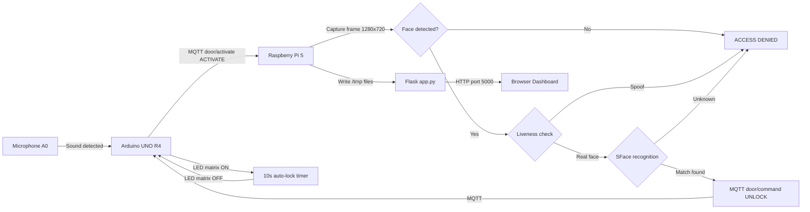

# Smart Door Lock System (IoT + AI)

   

A secure, biometric access control system capable of detecting faces and verifying identity against a local database, and physically unlocking a door mechanism. This project bridges **Computer Vision** models with **Embedded Systems**.

---

## Table of Contents
- [System Architecture](#-system-architecture)
- [Key Features](#-key-features)
- [Hardware Checklist](#-hardware-checklist)
- [Software Stack](#-software-stack)
- [Installation & Setup](#-installation--setup)
- [How to Run](#how-to-run)
- [Project Roadmap](#-project-roadmap)

---

## System Architecture

The system operates across four components connected over a local WiFi network:

1. **Arduino UNO R4 WiFi** — Physical client at the door. Detects sound via microphone, controls LED matrix and green LED, communicates via MQTT.
2. **Raspberry Pi 5** — Central server. Hosts the Mosquitto MQTT broker, runs the camera and face recognition pipeline.
3. **Flask Web App** — Runs on the Pi alongside main.py. Serves the real-time dashboard and REST API.
4. **Browser Dashboard** — Accessible from any device on the same network at http://192.168.0.5:5000.

### Communication Channels

| Channel | Between | Purpose |
|---|---|---|
| MQTT | Arduino ↔ Pi | door/activate (Arduino→Pi), door/command (Pi→Arduino) |
| /tmp files | main.py ↔ app.py | Shared state (frame, sound, lock status, UI label) |
| HTTP port 5000 | app.py ↔ Browser | Dashboard and REST API |

## File Structure

The project is organized into modular components to separate the Brain from the Controller.

```text
smart-door-lock/
├── firmware/                   # Arduino
│   └── lock_controller/        
│       └── lock_controller.ino # Main sketch for servo & serial handling
│
├── src/                        # Raspberry Pi Source Code
│   ├── main.py                 # Main entry point (Run this!)
│   ├── smart_lock_arduino.ino  # Arduino sketch (upload via Arduino IDE)
│   ├── api/
│   │   ├── app.py               # Flask web server and REST API
│   │   ├── database.py          # SQLite access logs
│   │   ├── camera.py            # Camera frame reader
│   │   └── system_health.py     # CPU temp, memory, disk
│   ├── web/
│   │   ├── templates/
│   │   │   └── dashboard.html   # Dashboard UI
│   │   └── static/
│   │       └── app.js           # Dashboard JavaScript
│   ├── config.py               # Global settings (PINs, Baud rates, API keys)
│   ├── vision/                 # Computer Vision Modules
│   │   ├── face_rec.py         # DeepFace recognition logic
│   │   └── liveness.py         # Anti-spoofing/Liveness detection
│   └── comms/                  # Hardware Communication
│       └── serial_bus.py       # USB Serial handshake protocol
│       └── mqtt.py             # MQTT handshake protocol
│
├── assets/                     # Hardware Documentation
│   ├── cad_models/             # .STL files for 3D printed enclosures
│   └── diagrams/               # Wiring schematics
│
├── tests/                      # Unit Tests
│   ├── test_camera.py          # Camera feed verification
│   └── test_servo.py           # Serial command testing
│
├── data/                       # Local Data gitignored
│   ├── authorized_faces/       # Reference images for valid users
│   └── logs/                   # Access logs & security alerts
│
├── requirements.txt            # Python dependencies
└── README.md                   # Documentation
```

## Project Data Flow



---

## Key Features

- **Sound triggered activation** — Clap or knock near the mic to start face recognition
- **Face recognition** — DeepFace SFace model, cosine distance threshold 0.5
- **Liveness detection** — Anti-spoofing check before recognition
- **Auto-lock** — Arduino locks automatically after 10 seconds, no Pi command needed
- **Real-time dashboard** — Live camera feed, lock status, sound detection, access logs
- **Manual unlock** — Unlock from the browser dashboard without face recognition
- **Access logging** — SQLite database with entry, denied, spoof and manual unlock events
- **System health** — CPU temperature, memory and disk usage displayed live

---

## Hardware Checklist

| Component | Connection | Status |
|---|---|---|
| Arduino UNO R4 WiFi | WiFi (MQTT) | ✅ Working |
| Microphone module | Arduino A0 | ✅ Working |
| Pull-down resistor 5kΩ | A0 to GND | ✅ Required |
| Green LED | Arduino pin 13 | ✅ Working |
| LED Matrix (built-in) | Built-in | ✅ Working |
| Raspberry Pi 5 | WiFi | ✅ Working |
| Pi Camera | CSI connector | ✅ Working |
| Servo motor | Arduino | ⏳ Pending |

---

## Software Stack

| Component | Technology |
|---|---|
| Face recognition | DeepFace (SFace model) |
| Liveness detection | DeepFace anti-spoofing |
| MQTT broker | Mosquitto |
| MQTT clients | paho-mqtt (Pi), ArduinoMqttClient (Arduino) |
| Web server | Flask |
| Database | SQLite |
| Camera capture | rpicam-vid subprocess + OpenCV |
| Dashboard frontend | HTML + JavaScript (vanilla) |

---

---

## Installation & Setup

### Raspberry Pi
```bash
cd project/smart-door-lock
python -m venv venv310
source venv310/bin/activate
pip install opencv-python deepface tensorflow numpy paho-mqtt flask flask-cors psutil pytz
```

### Arduino

Required libraries (Tools → Manage Libraries):
- WiFiS3 — built-in with UNO R4 board package
- ArduinoMqttClient
- Arduino_LED_Matrix — built-in with UNO R4 board package
- Servo — built-in with Arduino IDE

---
## Arduino Setup

Before uploading `smart_lock_arduino.ino`, update these lines in the sketch:

**WiFi credentials:**
```cpp
const char* ssid = "YourWiFiName";
const char* password = "YourWiFiPassword";
```

**MQTT Broker IP** (run `hostname -I` on Pi to get it):
```cpp
const char* broker = "192.168.0.x";
const int port = 1883;
```
---

## How to Run

**Step 1 — Start Mosquitto:**
```bash
sudo systemctl start mosquitto
```

**Step 2 — Terminal 1, run main.py:**
```bash
cd project/smart-door-lock
source venv310/bin/activate
cd src
python main.py
```

**Step 3 — Terminal 2, run the dashboard:**
```bash
cd project/smart-door-lock
source venv310/bin/activate
python src/api/app.py
```

**Step 4 — Open the dashboard:**
```
http://192.168.0.5:5000
```

### Keyboard controls (camera window must be focused)
- `c` — manually trigger face recognition
- `q` — quit

---

## Adding an Authorized Face
```bash
mkdir data/authorized_faces/PersonName
# add at least 3 clear JPG or PNG face images
# restart main.py
```

---

## MQTT Topics

| Topic | Direction | Payload | Used |
|---|---|---|---|
| door/activate | Arduino → Pi | ACTIVATE | ✅ Active |
| door/command | Pi → Arduino | UNLOCK | ✅ Active |

---

## Project Roadmap

- [x] MQTT communication between Arduino and Pi
- [x] Sound detection with mic baseline calibration
- [x] Face detection and liveness check
- [x] SFace face recognition with cosine distance
- [x] Auto-lock timer on Arduino
- [x] Flask web dashboard with live camera feed
- [x] Access logging to SQLite
- [x] Manual unlock from dashboard
- [x] System health monitoring
- [ ] Servo motor integration (hardware pending)
- [ ] Door sensor integration
